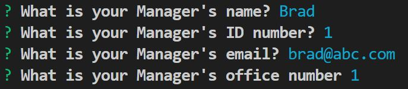
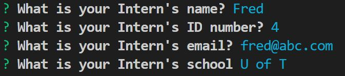

# Employee-Summary
Assignment - Week 10

##About

In this assignment I created a ode CLI that takes in information about employees and generates an HTML webpage that displays summaries for each person.

##How it works

 * The application will prompt the user for information about the team manager 

 * Then information about the team members. The user can input any number of team members, and they may be a mix of engineers and interns.

 * Engineer input:

 * Intern input:

 *  When the user has completed building the team, the application will create an HTML file that displays a nicely formatted team roster based on the information provided by the user

 * Here is how it works

----------

## Testing

 * The application must run and pass all unit tests.

 * Here is the testing

